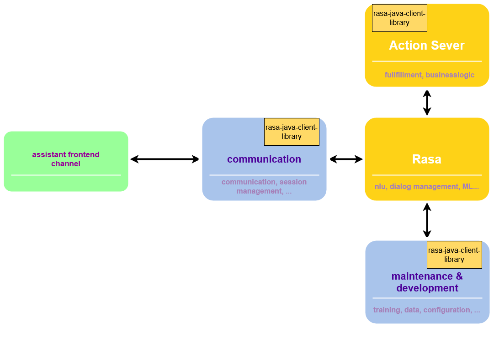

# rasa-java-client-library

A Java SDK for [Rasa Open Source](https://rasa.com/docs/rasa/)

The **rasa-java-client-library** wraps the [Rasa OpenSource HTTP API](https://rasa.com/docs/rasa/http-api)
and enables you to build your Rasa assistant application with Java. 

- Use the comfortable `RasaClient` to connect to the Rasa Server and talk to or train your Rasa assistant
- Use the flexible `ModelApi`, `DomainApi` and `TrackerApi` to implement additional advanced features, 
  e.g. [interactive learning](https://rasa.com/docs/rasa/writing-stories#using-interactive-learning)

### Version

`current version: 0.1.0` (unstable)

## Installation
**Attention!**
- This is a GitHub package. You need to [authenticate to GitHub Packages](https://docs.github.com/en/free-pro-team@latest/packages/guides/configuring-gradle-for-use-with-github-packages#installing-a-package) first.
- Currently available version `0.1.0` is unstable!

### Maven

```xml
<dependency>
  <groupId>io.github.arturkorb</groupId>
  <artifactId>rasa-java-client-library</artifactId>
  <version>0.1.0</version>
</dependency>
```

### Gradle

```groovy
dependencies {
  implementation 'io.github.arturkorb:rasa-java-client-library:0.1.0'
}
```


## Compatibility with Rasa

| rasa-java-client-library version    | compatible Rasa version           |
|----------------|-----------------------------------|
| `0.1.0`        | `>=2.2.0`                         |

## Use Case

Use the **rasa-java-client-library** if you consider building your Rasa assistant application with Java. 
A typical architecture of such a Rasa assistant application could look like this:



The picture shows in which components the **rasa-java-client-library** can be used. 
- Used in the communication component for talking with the bot and retrieving context (NLU parse results, etc.)
- Used in the maintenance/development component for training and configuration
- Used in [Action Service](https://rasa.com/docs/action-server) for building response and event objects when executing 
action

## Usage

Examples:

```groovy
        /*RasaClient usage example*/
        RasaClient rasaClient = new RasaClient().withBasePath("http://<rasa server url>:5005");
        
        //build your request from your training data
        YAMLTrainingRequest yamlTrainingRequest = new YAMLTrainingRequest();
        yamlTrainingRequest
                .config("<content of 'config.yml' as String>")
                .domain("<content of 'domain.yml' as String>")
                .nlu("<content of 'nlu.yml' as String>")
                .stories("<content of 'stories.yml' as String>")
                .rules("<content of 'rules.yml' as String>");
        
        //training
        rasaClient.trainModel(yamlTrainingRequest);
                
        //talking
        BotAnswer botAnswer = rasaClient.sendMessage("hi", "<user id>");
                
        //context
        Context context = rasaClient.sendMessageWithContextRetrieval("hi", "<user id");
        ParseResult result = context.getParseResult();
        Intent intent = result.getIntent();        
```

```groovy
        /*ServerInformationApi usage example*/
        ServerInformationApi serverInformationApi = new ServerInformationApi();
        InlineResponse200 version = serverInformationApi.getVersion();
```

```groovy
        /*DomainApi usage example*/
        DomainApi domainApi = new DomainApi();
        Domain domain = domainApi.getDomain();
        DomainConfig config = domain.getConfig();
```

```groovy
        /*TrackerApi usage example*/
        TrackerApi trackerApi = new TrackerApi();
        Tracker conversationTracker = trackerApi.getConversationTracker("<conversation_ID>", "ALL", null);
```

```groovy
        /*ModelApi usage example*/
        ModelApi modelApi = new ModelApi();
        ModelRequest modelRequest = new ModelRequest();
        modelRequest = modelRequest.modelFile("/app/models/" + "<your model file name>");
        modelApi.replaceModel(modelRequest);
```
